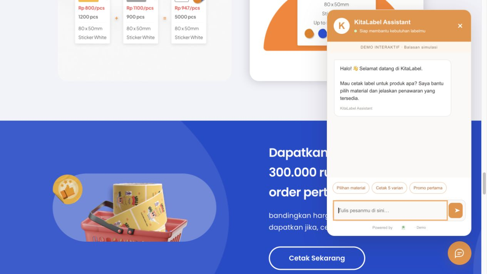

# KitaLabel × SapaGo demo

[Buka demo privat](https://kitalabel-sapago-demo.vvidiviciansyah.chatgpt.site) (login ChatGPT diperlukan).

Landing page duplikat https://marketz.kitalabel.com/ dengan aset, warna, konten dan video dari referensi publik. Runtime WordPress dan tracking dilepas. Interaksi material, galeri, FAQ dan chat berjalan dengan JavaScript lokal.

Preview: `python3 -m http.server 4173 --bind 127.0.0.1 --directory dist`

Chat bawaan adalah **simulasi**, bukan balasan AI live. Tidak mengirim pesan ke admin, tidak menyimpan percakapan, dan tidak membuat pesanan. Tombol konsultasi membuka chat demo.

Untuk widget SapaGo live khusus Kitalabel, isi `publicKey` pada `dist/config.js` dengan public widget identifier `lc_pk_...` dari embed Kitalabel. Jangan gunakan key brand lain atau private API token. Widget live menggantikan simulasi saat iframe SapaGo berhasil dimuat; kegagalan pemuatan tetap menyediakan simulasi. Verifikasi koneksi live setelah konfigurasi tersedia.

`mirror.py` adalah helper rekonstruksi dari HTML referensi lokal di `/tmp/kitalabel-reference.html`. File hasil yang siap hosting ada di `dist/`; pengubahan desain dilakukan di situ.
